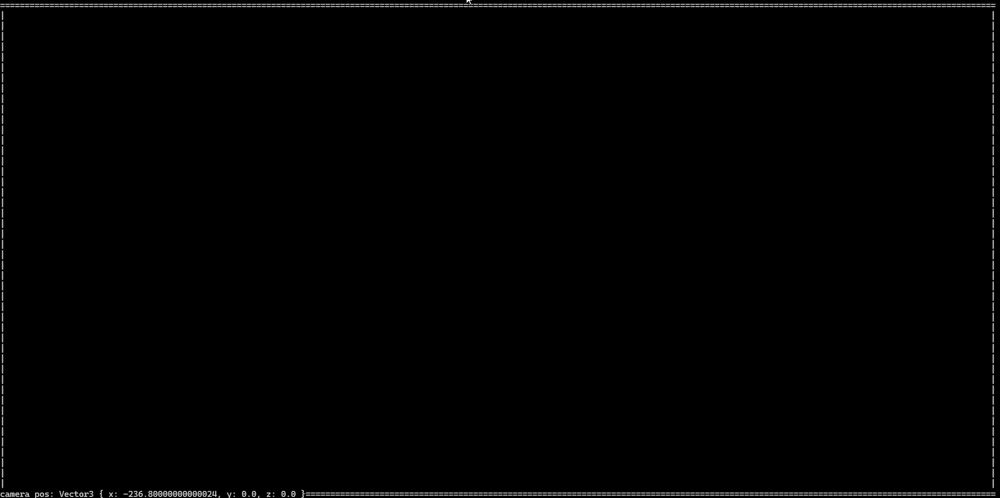

* luo abstraktit vektori- ja matriisikirjastot
* luo objekti ja siihen liittyvät tyyppimääritteet
* luo skene ja siihen liittyvät tyyppimääritteet
* luo raytracingiin liittyvät tyyppimääritteet (ei vielä kimmotuksia ehkä)
* luo kamera ja siihen liittyvät tyyppimääritteet
* luo user inputtia varten tarvittavat metodit ja toiminnallisuus
* luo 3d-objektin renderöinti, jossa perspektiiviä voi liikuttaa (kameran asetuksia voi muokata)
